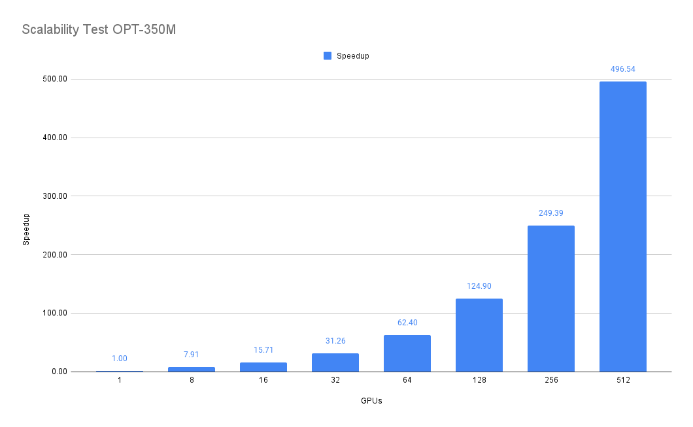
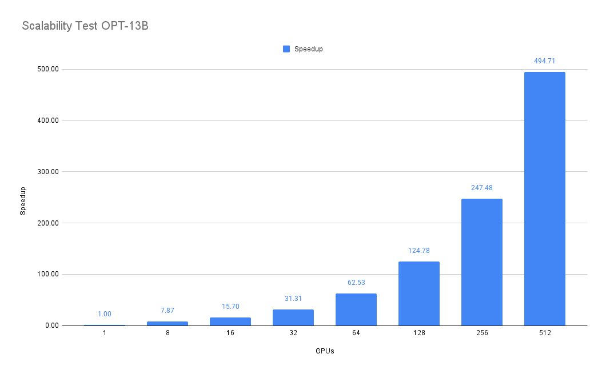

# Benchmark DeepSpeed-Chat Training on Lambda 1-Click Clusters

## Set up
```
# Tell me where is your shared storage
export SHARED_STORAGE=<NAME-OF-SHARED-STORAGE> && \
export PROJECT_PATH=/home/ubuntu/${SHARED_STORAGE}/benchmark

# Setup the repo
# This will take ~30 mins including caching model and datasets
wget https://raw.githubusercontent.com/LambdaLabsML/DeepSpeedExamples/master/applications/DeepSpeed-Chat/./setup_deepchat.sh && \
./setup_deepchat.sh
```


# Run benchmark
```
# Benchmark node-001
# node1: name of the hostfile
# 1    : cluster size (in this case only one node)
# opt-350m_bs24_zero0: name of the benchmark script (see opt-350m_bs24_zero0.sh for details)
cd ${PROJECT_PATH}/DeepSpeedExamples/applications/DeepSpeed-Chat/training && \
./run_benchmark.sh node1 1 opt-350m_bs24_zero0

# Sub-divide ./nodes/hosts.txt into smaller clusters, and benchmark them in parallel.
# hosts: name of the hostfile
# 2    : sub-cluster size (in this case each cluster has two nodes)
cd ${PROJECT_PATH}/DeepSpeedExamples/applications/DeepSpeed-Chat/training && \
./run_benchmark.sh hosts 2 opt-350m_bs24_zero0
```

The throughputs will be saved to the csv files inside `./results`. Full console output will be saved in the log files in the `./output` folder.

# Results
Here are the reference throughputs (`samples/sec`) of a 64xNodes (512x NVIDIA H100s) 1-Click Cluster.

| NUM_GPUs | opt-350m_bs24_zero0 | opt-13b_bs16_zero0 |
|----------|---------------------|--------------------|
| 8        |      943        |       72       |
| 16       |     1874        |      145       |
| 32       |     3729        |      290       |
| 64       |     7443        |      579       |
| 128      |    14899        |     1156       |
| 256      |    29750        |     2294       |
| 512      |    59233        |     4586       |


<p align="center">
  
  
</p>
